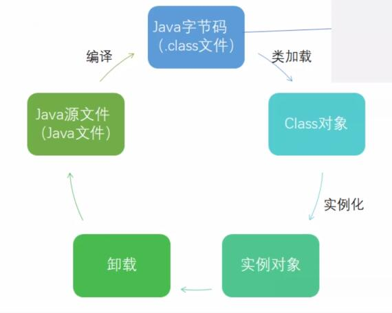

### 代理模式

 - 1 代理模式

从代理模式到静态代理
 - 2 静态代理
     * 静态代理群在的问题: *
        - 违反了开闭原则, 扩展性差,可维护性差
         每次有新的需求就要修改代理类, 不能只专注业务逻辑, 不符合开闭原则: 对扩展是开放的, 对修改是关闭的
         
        
从静态代理到动态代理
 - 3 动态代理
    - jdk动态代理 必须要实现一个接口
    
    - cglib动态代理

### 知识点
 - 类完整的生命周期
    
  java源文件(.java) --编译--> java字节码文件(.class) --类加载--> Class对象 --实例化--> 实例对象 --> 卸载 ..>
