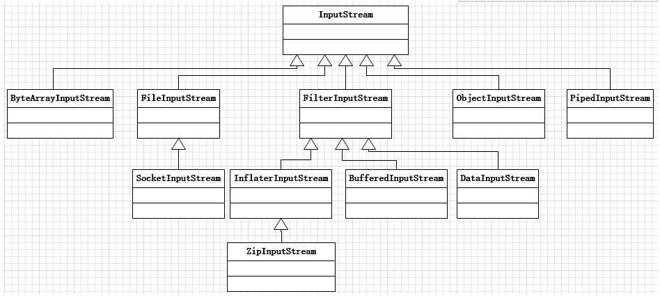

### 装饰器模式

装饰器模式又称为包装（Wrapper）模式。装饰器模式以多客户端透明的方式扩展对象的功能，是继承关系的一个替代方案。

通常给对象添加功能，要么直接修改对象添加相应的功能，要么派生子类来扩展，抑或是使用对象组合的方式。
显然，直接修改对应的类的方式并不可取，在面向对象的设计中，我们应该尽量使用组合对象而不是继承对象来扩展和复用功能，**装饰器模式就是基于对象组合的方式的。**

装饰器模式以对客户端透明的方式动态地给一个对象附加上了更多的责任。换言之，客户端并不会角色对象在装饰前和装饰后有什么不同。装饰器模式可以在不用创建更多子类的情况下，将对象的功能加以扩展。

**装饰器模式中的角色有：**

1、抽象构件角色
给出一个抽象接口，以规范准备接受附加责任的对象

2、具体构件角色
定义一个将要接受附加责任的类

3、装饰角色
持有一个构建对象的实例，并定义一个与抽象构件接口一致的接口

4、具体装饰角色
负责给构建对象贴上附加的责任

**java中的使用：**
装饰器模式在Java体系中的经典应用是Java I/O，下面先讲解字节输入流InputStream，再讲解字符输入流Reader，希望可以通过这两种输入流的讲解，加深对于装饰器模式的理解。
首先看一下字节输入流InputStream的类结构体系：
 
 
 InputStream是一个顶层的接口，文章开头就说，装饰器模式是继承关系的一种替代方案，看一下为什么：
 
 InputStream假设这里写了两个实现类，FileInputStream，ObjectInputStream分别表示文件字节输入流，对象字节输入流.
 现在我要给这两个输入流加入一点缓冲功能以提高输入流效率，使用继承的方式，那么就写一个BufferedInputStream，继承FileInputStream，ObjectInputStream，给它们加功能,
 现在我有另外一个需求，需要给这两个输入流加入一点网络功能，那么就写一个SocketInputStream，继承继承FileInputStream，ObjectInputStream，给它们加功能,
 
 这样就导致两个问题：
 因为我要给哪个类加功能就必须继承它，比如我要给FileInputStream，ObjectInputStream加上缓冲功能、网络功能就得扩展出2*2=4个类，更多的以此类推，这样势必导致类数量不断膨胀
 代码无法复用，给FileInputStream，ObjectInputStream加入缓冲功能，本身代码应该是一样的，现在却必须继承完毕后把一样的代码重写一遍，多此一举，代码修改的时候必须修改多个地方，可维护性很差
 
 所以，这个的时候我们就想到了一种解决方案：
 在要扩展的类比如BufferedInputStream中持有一个InputStream的引用，在BufferedInputStream调用InputStream中的方法，这样扩展的代码就可以复用起来
 将BufferedInputStream作为InputStream的子类，这样客户端只知道我用的是InputStream而不需要关心具体实现，可以在客户端不知情的情况下，扩展InputStream的功能，加上缓冲功能
 
 **装饰器模式和适配器模式的区别：**
 其实适配器模式也是一种包装（Wrapper）模式，它们看似都是起到包装一个类或对象的作用，但是它们使用的目的非常不一样：
 1、适配器模式的意义是要将一个接口转变成另外一个接口，它的目的是通过改变接口来达到重复使用的目的
 2、装饰器模式不要改变被装饰对象的接口，而是恰恰要保持原有的借口哦，但是增强原有接口的功能，或者改变元有对象的处理方法而提升性能
 
 所以这两种设计模式的目的是不同的。